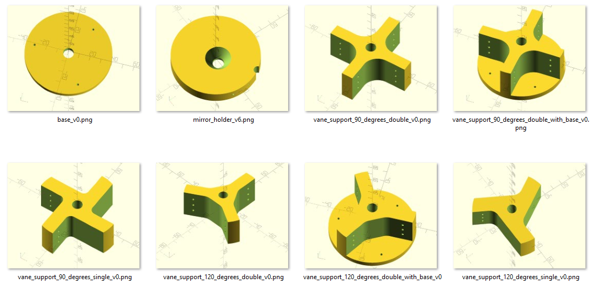

# Telescope Spider design
OpenScad parametric designs of telescope spider and secondary mirror holder 

## What is this?
Most reflector telescopes need a secondary mirror to be supported in front of the primary mirror. The support system, called spider, has 2 parts: a collimation system in front of the mirror and some vanes extending to the tube.
This directory offers various design styles for the collimation system and vane connections, allowing for 3, 4, 6 or 8 vanes.
The designs are parametric to easily scale to any telescope size, and adapt the hardware (screws) accordingly.

## Recommended workflow
- Open the files provided in OpenScad (open source software). You can then change the parametric dimensions at the beginning of the file to adjust exactly to your project requirments. You do not need to modify any of the openScad source (this is the beauty of parametric designs) but you can certainly customize things as needed.
- Optional but highly recommanded: 3D print a prototype to verify size and function. Iterate 1 to 2 until you are pefectly satisfy.
- Comment the $fn line in the openScad file (just add // in front). If you forget this step your object will be faceted rater than solid, hence very difficult to machine.
- Open FreeCad (open source software), do: file>new, file>import from OpenScad, file>export to step.
- Get your object machined in metal with a CNC router:
-- load your stepfile to one of the online machining service.
-- send the stepfile to your favorite machinist.
-- machin it yourself, maybe at your local maker space or college workshop.

## Notes
I use Aluminum 6061, Black Anodize, and tap the holes manually.

## More ressources on this
Visit http://erellaz.com

